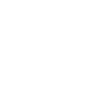

  
  <h1>template-rust</h1>
  
<strong>For quickly setting up a Github project</strong>

## Getting Started

Simply change all instances of string **template-rust** to the name of your new project, set the correct remote url and don't forget to update the readme file!

Or alternatively, update main.rs with your project information and run `cargo run`

## Contributing

See the [contributing](Contributing.md) guide for detailed instructions on how to get started with this project.

## License

The project is made available under the MIT license. See the [license](License.md) file for more information.
